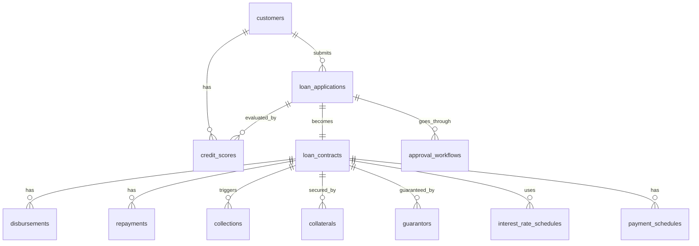

# Entity Relationship Diagram Documentation

## Tổng quan

Tài liệu này mô tả chi tiết các mối quan hệ giữa các entities trong hệ thống database quản lý cho vay.

## ERD Diagram



## Chi tiết Relationships

### 1. customers → loan_applications
**Cardinality**: One-to-Many (1:N)
**Relationship**: Một khách hàng có thể có nhiều đơn xin vay
**Foreign Key**: `loan_applications.customer_id` → `customers.customer_id`
**On Delete**: RESTRICT (không cho phép xóa khách hàng nếu có đơn vay)
**On Update**: CASCADE (cập nhật customer_id nếu customers.customer_id thay đổi)

**Business Logic**:
- Khách hàng có thể tạo nhiều đơn vay tại các thời điểm khác nhau
- Mỗi đơn vay phải thuộc về một khách hàng cụ thể

### 2. customers → credit_scores
**Cardinality**: One-to-Many (1:N)
**Relationship**: Một khách hàng có thể có nhiều điểm tín dụng theo thời gian
**Foreign Key**: `credit_scores.customer_id` → `customers.customer_id`
**On Delete**: RESTRICT
**On Update**: CASCADE

**Business Logic**:
- Điểm tín dụng được cập nhật định kỳ hoặc khi có đơn vay mới
- Lưu lịch sử điểm tín dụng để theo dõi xu hướng

### 3. loan_applications → loan_contracts
**Cardinality**: One-to-One (1:1)
**Relationship**: Một đơn vay được phê duyệt sẽ trở thành một hợp đồng
**Foreign Key**: `loan_contracts.application_id` → `loan_applications.application_id`
**On Delete**: RESTRICT
**On Update**: CASCADE

**Business Logic**:
- Chỉ đơn vay có status = 'approved' mới có thể tạo contract
- Mỗi đơn approved chỉ tạo một contract
- Contract có thể được tạo sau khi đơn được phê duyệt

### 4. loan_applications → approval_workflows
**Cardinality**: One-to-Many (1:N)
**Relationship**: Một đơn vay có thể trải qua nhiều cấp phê duyệt
**Foreign Key**: `approval_workflows.application_id` → `loan_applications.application_id`
**On Delete**: CASCADE (xóa workflow khi xóa application)
**On Update**: CASCADE

**Business Logic**:
- Quy trình phê duyệt đa cấp với nhiều approver_level
- Mỗi level có thể approve, reject, hoặc request_info
- Lịch sử phê duyệt được lưu lại đầy đủ

### 5. loan_applications → credit_scores
**Cardinality**: One-to-Many (1:N)
**Relationship**: Một đơn vay có thể được đánh giá bằng nhiều điểm tín dụng
**Foreign Key**: `credit_scores.application_id` → `loan_applications.application_id`
**On Delete**: SET NULL (giữ lại điểm tín dụng nếu xóa application)
**On Update**: CASCADE

**Business Logic**:
- Điểm tín dụng có thể được tính riêng cho từng đơn vay
- application_id có thể NULL nếu là điểm tín dụng tổng quát

### 6. loan_contracts → disbursements
**Cardinality**: One-to-Many (1:N)
**Relationship**: Một hợp đồng có thể có nhiều lần giải ngân
**Foreign Key**: `disbursements.contract_id` → `loan_contracts.contract_id`
**On Delete**: RESTRICT
**On Update**: CASCADE

**Business Logic**:
- Hỗ trợ giải ngân nhiều lần (partial disbursement)
- Tổng số tiền giải ngân không được vượt quá principal_amount
- Validation được thực hiện bằng trigger

### 7. loan_contracts → repayments
**Cardinality**: One-to-Many (1:N)
**Relationship**: Một hợp đồng có nhiều khoản thanh toán
**Foreign Key**: `repayments.contract_id` → `loan_contracts.contract_id`
**On Delete**: RESTRICT
**On Update**: CASCADE

**Business Logic**:
- Mỗi repayment có thể là scheduled hoặc ad-hoc payment
- scheduled_date không được trước disbursement_date
- Status tự động cập nhật dựa trên actual_payment_date

### 8. loan_contracts → collections
**Cardinality**: One-to-Many (1:N)
**Relationship**: Một hợp đồng có thể có nhiều hoạt động thu hồi
**Foreign Key**: `collections.contract_id` → `loan_contracts.contract_id`
**On Delete**: RESTRICT
**On Update**: CASCADE

**Business Logic**:
- Collections được tạo khi có khoản nợ quá hạn
- Có thể có nhiều loại collection activities (reminder, warning, legal_action, settlement)
- Theo dõi tiến trình thu hồi qua status và amount_collected

### 9. loan_contracts → collaterals
**Cardinality**: One-to-Many (1:N)
**Relationship**: Một hợp đồng có thể được đảm bảo bằng nhiều tài sản
**Foreign Key**: `collaterals.contract_id` → `loan_contracts.contract_id`
**On Delete**: RESTRICT
**On Update**: CASCADE

**Business Logic**:
- Một contract có thể có nhiều collaterals
- Collaterals có thể được release khi contract đóng hoặc seized khi default
- estimated_value và appraised_value được lưu để so sánh

### 10. loan_contracts → guarantors
**Cardinality**: One-to-Many (1:N)
**Relationship**: Một hợp đồng có thể có nhiều người bảo lãnh
**Foreign Key**: `guarantors.contract_id` → `loan_contracts.contract_id`
**On Delete**: RESTRICT
**On Update**: CASCADE

**Business Logic**:
- Một contract có thể có nhiều guarantors
- Mỗi guarantor có guarantee_amount riêng
- Guarantors có thể được release khi contract đóng

### 11. loan_contracts → interest_rate_schedules
**Cardinality**: One-to-Many (1:N)
**Relationship**: Một hợp đồng có thể có nhiều lịch lãi suất (cho lãi suất thả nổi)
**Foreign Key**: `interest_rate_schedules.contract_id` → `loan_contracts.contract_id`
**On Delete**: CASCADE (xóa schedules khi xóa contract)
**On Update**: CASCADE

**Business Logic**:
- Hỗ trợ lãi suất cố định (fixed) và thả nổi (floating)
- Với floating rate, có thể có nhiều schedules theo thời gian
- Chỉ một schedule active tại một thời điểm
- effective_date không được trước disbursement_date

### 12. loan_contracts → payment_schedules
**Cardinality**: One-to-Many (1:N)
**Relationship**: Một hợp đồng có nhiều kỳ trả nợ
**Foreign Key**: `payment_schedules.contract_id` → `loan_contracts.contract_id`
**On Delete**: CASCADE (xóa schedules khi xóa contract)
**On Update**: CASCADE

**Business Logic**:
- Mỗi contract có payment_schedules tương ứng với term_months
- installment_number là unique trong mỗi contract
- outstanding_amount tự động tính = total_due - paid_amount
- Status tự động cập nhật: paid nếu paid_amount >= total_due, overdue nếu due_date < today và paid_amount = 0

## Use Cases và Query Patterns

### Use Case 1: Tìm tất cả đơn vay của một khách hàng
```sql
SELECT la.*, cs.score, cs.rating
FROM loan_applications la
LEFT JOIN credit_scores cs ON la.application_id = cs.application_id
WHERE la.customer_id = ?
ORDER BY la.submitted_at DESC;
```

### Use Case 2: Xem chi tiết hợp đồng và tình trạng thanh toán
```sql
SELECT 
    c.*,
    SUM(ps.outstanding_amount) as total_outstanding,
    COUNT(CASE WHEN ps.status = 'overdue' THEN 1 END) as overdue_count
FROM loan_contracts c
LEFT JOIN payment_schedules ps ON c.contract_id = ps.contract_id
WHERE c.contract_id = ?
GROUP BY c.contract_id;
```

### Use Case 3: Tìm các khoản nợ quá hạn
```sql
SELECT 
    c.contract_id,
    c.contract_number,
    cu.full_name,
    ps.due_date,
    ps.outstanding_amount,
    DATEDIFF(CURDATE(), ps.due_date) as days_overdue
FROM payment_schedules ps
INNER JOIN loan_contracts c ON ps.contract_id = c.contract_id
INNER JOIN loan_applications la ON c.application_id = la.application_id
INNER JOIN customers cu ON la.customer_id = cu.customer_id
WHERE ps.status = 'overdue'
  AND ps.outstanding_amount > 0
ORDER BY ps.due_date ASC;
```

### Use Case 4: Xem lịch sử phê duyệt của một đơn vay
```sql
SELECT 
    aw.*,
    la.application_number,
    la.loan_amount
FROM approval_workflows aw
INNER JOIN loan_applications la ON aw.application_id = la.application_id
WHERE aw.application_id = ?
ORDER BY aw.approver_level ASC, aw.action_date ASC;
```

### Use Case 5: Tính tổng số tiền đã giải ngân và đã trả của một contract
```sql
SELECT 
    c.contract_id,
    c.principal_amount,
    COALESCE(SUM(d.amount), 0) as total_disbursed,
    COALESCE(SUM(r.total_amount), 0) as total_repaid
FROM loan_contracts c
LEFT JOIN disbursements d ON c.contract_id = d.contract_id AND d.status = 'completed'
LEFT JOIN repayments r ON c.contract_id = r.contract_id AND r.status = 'paid'
WHERE c.contract_id = ?
GROUP BY c.contract_id;
```

## Constraints và Validations

### Referential Integrity
- Tất cả foreign keys đều có constraints để đảm bảo data integrity
- ON DELETE rules:
  - RESTRICT: Cho các bảng core (customers, contracts) - không cho phép xóa nếu có dữ liệu liên quan
  - CASCADE: Cho các bảng phụ thuộc (workflows, schedules) - xóa cùng với parent
  - SET NULL: Cho credit_scores.application_id - giữ lại điểm nếu xóa application

### Business Rules Validation
- Triggers validate các business rules phức tạp:
  - Disbursement amount không vượt quá principal
  - Dates không được trước disbursement_date
  - Interest rate schedules không overlap
  - Payment schedules outstanding_amount tự động tính

### Data Validation
- Check constraints cho:
  - Amounts phải >= 0 hoặc > 0
  - Rates phải trong khoảng hợp lý (0-100%)
  - Scores phải trong khoảng 0-1000
  - Dates hợp lý (không quá khứ xa, không tương lai)

