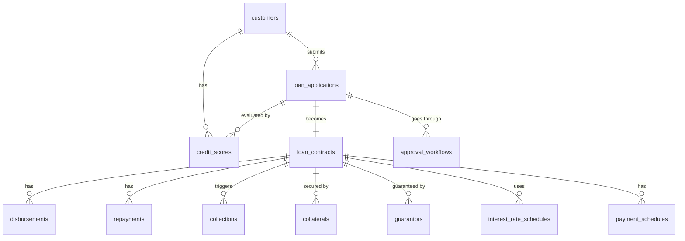

# 🏦 Loan Management System Database

> **Khóa luận tốt nghiệp — Nhóm 97**
> Học viện Công nghệ Bưu chính Viễn thông (PTIT)
> Ngành: Công nghệ Thông tin (FinTech)
> GVHD: ThS. Trần Quốc Khánh

Hệ thống cơ sở dữ liệu **OLTP** trên MySQL 8.0, quản lý toàn bộ **vòng đời khoản vay** — từ tiếp nhận hồ sơ, đánh giá tín dụng, phê duyệt đa cấp, giải ngân, trả nợ định kỳ, đến thu hồi nợ quá hạn — kèm theo dashboard phân tích KPI trên Power BI.

---

## 📑 Mục lục

- [Tổng quan dự án](#-tổng-quan-dự-án)
- [Cấu trúc thư mục](#-cấu-trúc-thư-mục)
- [Kiến trúc Database](#-kiến-trúc-database)
- [ERD — Sơ đồ quan hệ thực thể](#-erd--sơ-đồ-quan-hệ-thực-thể)
- [Yêu cầu hệ thống](#-yêu-cầu-hệ-thống)
- [Hướng dẫn cài đặt](#-hướng-dẫn-cài-đặt)
- [Sinh dữ liệu mẫu](#-sinh-dữ-liệu-mẫu)
- [Dashboard Power BI](#-dashboard-power-bi)
- [Các Query mẫu](#-các-query-mẫu)
- [Tài liệu dự án](#-tài-liệu-dự-án)
- [Công nghệ sử dụng](#-công-nghệ-sử-dụng)
- [Tác giả](#-tác-giả)
- [License](#-license)

---

## 🎯 Tổng quan dự án

Dự án xây dựng một hệ thống cơ sở dữ liệu quản lý cho vay **end-to-end**, bao gồm:

| Nghiệp vụ | Mô tả |
|---|---|
| **Quản lý khách hàng** | Lưu trữ thông tin cá nhân, trạng thái (active / inactive / blacklisted) |
| **Đơn xin vay** | Tiếp nhận hồ sơ với mã tự động sinh, theo dõi trạng thái phê duyệt |
| **Đánh giá tín dụng** | Hệ thống chấm điểm 0–1000 với xếp hạng (excellent / good / fair / poor) và các yếu tố đánh giá dạng JSON |
| **Phê duyệt đa cấp** | Quy trình 3 cấp: Chuyên viên → Trưởng nhóm → Giám đốc (tùy hạn mức) |
| **Hợp đồng vay** | Quản lý hợp đồng với lãi suất cố định/thả nổi, kỳ hạn linh hoạt |
| **Giải ngân** | Hỗ trợ giải ngân nhiều đợt, validation tổng giải ngân ≤ giá trị hợp đồng |
| **Lịch trả nợ** | Tính toán amortization (dư nợ giảm dần), tự động cập nhật trạng thái kỳ nợ |
| **Thu hồi nợ** | Theo dõi hoạt động thu hồi: nhắc nhở, cảnh báo, pháp lý, thỏa thuận |
| **Tài sản thế chấp** | Quản lý BĐS, xe, tiền gửi, tài sản khác với giá trị ước tính/thẩm định |
| **Người bảo lãnh** | Thông tin người bảo lãnh và số tiền bảo lãnh cho từng hợp đồng |

---

## 📂 Cấu trúc thư mục

```
Loan Management System Database/
│
├── 1. DOMAIN KNOWLEDGE/               # Nghiên cứu nghiệp vụ & nền tảng lý thuyết
│   ├── ONTOLOGY.md                     #   Ontology & quy trình phân tích nghiệp vụ (BA)
│   ├── TỔNG QUAN NGHIỆP VỤ.md         #   Phân tích nghiệp vụ cho vay chi tiết
│   ├── KHÓA LUẬN TỐT NGHIỆP - NHÓM 97.md  #   Nội dung khóa luận
│   └── 97.FinTech.ThS.Trần Quốc Khánh.docx #   Tài liệu hướng dẫn GVHD
│
├── 2. DATABASE DESIGN/                 # Thiết kế & triển khai CSDL
│   ├── schema/                         #   13 file SQL migration (chạy theo thứ tự)
│   │   ├── 001_create_customers_table.sql
│   │   ├── 002_create_loan_applications_table.sql
│   │   ├── 003_create_loan_contracts_table.sql
│   │   ├── 004_create_disbursements_table.sql
│   │   ├── 005_create_repayments_table.sql
│   │   ├── 006_create_collections_table.sql
│   │   ├── 007_create_collaterals_table.sql
│   │   ├── 008_create_guarantors_table.sql
│   │   ├── 009_create_credit_scores_table.sql
│   │   ├── 010_create_approval_workflows_table.sql
│   │   ├── 011_create_interest_rate_schedules_table.sql
│   │   ├── 012_create_payment_schedules_table.sql
│   │   └── 013_add_indexes_and_constraints.sql
│   └── docs/                           #   Tài liệu thiết kế
│       ├── database_design.md          #     Thiết kế chi tiết database
│       ├── entity_relationship_diagram.md  #  ERD & mô tả quan hệ
│       └── deployment_guide.md         #     Hướng dẫn triển khai bare-metal
│
├── 3. SAMPLE DATA/                     # Script Python sinh & quản lý dữ liệu
│   ├── generate_test_data.py           #   Sinh dữ liệu mẫu (~1000 KH, ~2000 đơn vay)
│   ├── clear_database.py              #   Xóa sạch dữ liệu (TRUNCATE)
│   ├── monitor_database.py            #   Giám sát sức khỏe DB (connections, buffer pool)
│   └── profile_database.py            #   Đo lường hiệu suất query (EXPLAIN + benchmark)
│
├── 4. DASHBOARD/                       # Báo cáo & trực quan hóa
│   ├── Loan Management System Dashboard.pbix  # Dashboard Power BI (3 trang)
│   └── so_tay_kpi_dashboard_quan_ly_khoan_vay.md  # Sổ tay giải thích 40+ KPI
│
├── pyproject.toml                      # Cấu hình Python project (uv/pip)
├── uv.lock                            # Lock file dependencies
└── README.md                          # ← Bạn đang đọc file này
```

---

## 🗄️ Kiến trúc Database

### 12 bảng — Normalize đến 3NF

| # | Bảng | Vai trò | Loại |
|---|---|---|---|
| 1 | `customers` | Thông tin khách hàng | Core |
| 2 | `loan_applications` | Đơn xin vay | Core |
| 3 | `loan_contracts` | Hợp đồng vay | Core |
| 4 | `disbursements` | Giải ngân | Core |
| 5 | `repayments` | Trả nợ | Core |
| 6 | `collections` | Thu hồi nợ quá hạn | Core |
| 7 | `collaterals` | Tài sản thế chấp | Supporting |
| 8 | `guarantors` | Người bảo lãnh | Supporting |
| 9 | `credit_scores` | Điểm tín dụng | Supporting |
| 10 | `approval_workflows` | Quy trình phê duyệt | Supporting |
| 11 | `interest_rate_schedules` | Lịch lãi suất | Supporting |
| 12 | `payment_schedules` | Lịch trả nợ | Supporting |

### Đặc điểm kỹ thuật

- **Data Types**: `BIGINT` cho PK (hỗ trợ scale lớn), `DECIMAL(15,2)` cho tiền tệ, `JSON` cho dữ liệu linh hoạt
- **Triggers**: Auto-generate mã đơn/hợp đồng/giải ngân, auto-calculate ngày đáo hạn và dư nợ, validation business rules
- **Indexes**: Composite indexes cho các query pattern phổ biến (overdue lookup, customer search, contract filtering)
- **Constraints**: FK với ON DELETE RESTRICT/CASCADE/SET NULL phù hợp, CHECK constraints cho amounts > 0, rates 0–100%
- **View**: `vw_loan_summary` — tổng hợp thông tin khoản vay để báo cáo

---

## 🔗 ERD — Sơ đồ quan hệ thực thể



---

## ⚙️ Yêu cầu hệ thống

| Thành phần | Yêu cầu |
|---|---|
| **MySQL** | 8.0 trở lên |
| **Python** | 3.13+ (cho script sinh dữ liệu) |
| **Power BI Desktop** | Phiên bản mới nhất (cho dashboard) |
| **RAM** | Tối thiểu 4GB (khuyến nghị 8GB cho production) |
| **Disk** | Tối thiểu 20GB trống |

---

## 🚀 Hướng dẫn cài đặt

### Bước 1 — Tạo Database

```sql
CREATE DATABASE loan_management
    CHARACTER SET utf8mb4
    COLLATE utf8mb4_unicode_ci;

USE loan_management;
```

### Bước 2 — Chạy Migration (theo thứ tự)

```bash
# Chạy lần lượt 13 file SQL
for file in "2. DATABASE DESIGN/schema/"*.sql; do
    mysql -u root -p loan_management < "$file"
done
```

Hoặc chạy từng file thủ công:

```bash
mysql -u root -p loan_management < "2. DATABASE DESIGN/schema/001_create_customers_table.sql"
mysql -u root -p loan_management < "2. DATABASE DESIGN/schema/002_create_loan_applications_table.sql"
# ... tiếp tục đến file 013
```

### Bước 3 — Kiểm tra

```sql
-- Kiểm tra 12 bảng đã được tạo
SHOW TABLES;

-- Kiểm tra triggers
SHOW TRIGGERS;

-- Kiểm tra view
SHOW FULL TABLES WHERE Table_type = 'VIEW';
```

> 📖 **Triển khai production?** Xem chi tiết tại [deployment_guide.md](2.%20DATABASE%20DESIGN/docs/deployment_guide.md) — bao gồm cấu hình MySQL, bảo mật, backup, monitoring.

---

## 🧪 Sinh dữ liệu mẫu

Sử dụng Python script để sinh dữ liệu thực tế cho việc test và demo:

### Cài đặt dependencies

```bash
# Sử dụng uv (khuyến nghị)
uv sync

# Hoặc pip
pip install faker mysql-connector-python pandas
```

### Chạy script sinh dữ liệu

```bash
cd "3. SAMPLE DATA"
python generate_test_data.py
```

Script sẽ sinh:
- **~1.000** khách hàng (tên, địa chỉ, CCCD tiếng Việt qua Faker)
- **~2.000** đơn xin vay với phân bố trạng thái thực tế
- **~1.400** hợp đồng vay (từ đơn approved)
- Điểm tín dụng, quy trình phê duyệt đa cấp, giải ngân, lịch trả nợ (amortization)
- Tài sản thế chấp (BĐS, xe, tiền gửi...) và người bảo lãnh
- Hoạt động thu hồi nợ

### Các script tiện ích khác

| Script | Chức năng |
|---|---|
| `clear_database.py` | Xóa sạch toàn bộ dữ liệu (TRUNCATE) với xác nhận trước khi xóa |
| `monitor_database.py` | Báo cáo sức khỏe DB: connections, slow queries, table sizes, buffer pool |
| `profile_database.py` | Đo lường hiệu suất các query quan trọng (EXPLAIN + benchmark 10 lần) |

---

## 📊 Dashboard Power BI

File `Loan Management System Dashboard.pbix` gồm **3 trang phân tích**:

| Trang | Nội dung | Đối tượng sử dụng |
|---|---|---|
| **Trang 1** | Tổng quan danh mục cho vay — giải ngân, dư nợ, dòng tiền, cơ cấu | Ban điều hành, Quản lý tài chính |
| **Trang 2** | Hồ sơ vay & phê duyệt tín dụng — funnel, TAT, điểm tín dụng, approval rate | Quản lý tín dụng, Chuyên viên thẩm định |
| **Trang 3** | Quá hạn, thu hồi & tài sản bảo đảm — PAR, DPD, LTV, recovery rate | Quản lý rủi ro, Thu hồi nợ |

> 📖 Xem [Sổ tay KPI](4.%20DASHBOARD/so_tay_kpi_dashboard_quan_ly_khoan_vay.md) để hiểu chi tiết công thức DAX, logic nghiệp vụ và cách đọc insight cho **40+ KPI**.

---

## 🔍 Các Query mẫu

### Tìm đơn vay của một khách hàng

```sql
SELECT
    la.application_number,
    la.loan_amount,
    la.status,
    la.submitted_at,
    cs.score,
    cs.rating
FROM loan_applications la
LEFT JOIN credit_scores cs ON la.application_id = cs.application_id
WHERE la.customer_id = 1
ORDER BY la.submitted_at DESC;
```

### Xem hợp đồng và tình trạng thanh toán

```sql
SELECT
    c.contract_number,
    c.principal_amount,
    c.interest_rate,
    c.status,
    COUNT(ps.schedule_id) AS total_installments,
    SUM(ps.outstanding_amount) AS total_outstanding,
    COUNT(CASE WHEN ps.status = 'overdue' THEN 1 END) AS overdue_count
FROM loan_contracts c
LEFT JOIN payment_schedules ps ON c.contract_id = ps.contract_id
WHERE c.contract_id = 1
GROUP BY c.contract_id;
```

### Tìm các khoản nợ quá hạn

```sql
SELECT
    c.contract_number,
    cu.full_name,
    ps.due_date,
    ps.outstanding_amount,
    DATEDIFF(CURDATE(), ps.due_date) AS days_overdue
FROM payment_schedules ps
INNER JOIN loan_contracts c ON ps.contract_id = c.contract_id
INNER JOIN loan_applications la ON c.application_id = la.application_id
INNER JOIN customers cu ON la.customer_id = cu.customer_id
WHERE ps.status = 'overdue'
  AND ps.outstanding_amount > 0
ORDER BY ps.due_date ASC;
```

### Xem tổng quan qua View

```sql
-- Tất cả khoản vay
SELECT * FROM vw_loan_summary;

-- Khoản vay đang active
SELECT * FROM vw_loan_summary WHERE contract_status = 'active';

-- Khoản vay có nợ quá hạn
SELECT * FROM vw_loan_summary WHERE overdue_installments > 0;
```

---

## 📚 Tài liệu dự án

| Tài liệu | Nội dung |
|---|---|
| [Database Design](2.%20DATABASE%20DESIGN/docs/database_design.md) | Chi tiết thiết kế 12 bảng, business rules, constraints, performance |
| [ERD Documentation](2.%20DATABASE%20DESIGN/docs/entity_relationship_diagram.md) | Mô tả 12 relationships, cardinality, query patterns |
| [Deployment Guide](2.%20DATABASE%20DESIGN/docs/deployment_guide.md) | Hướng dẫn triển khai bare-metal: cài đặt, cấu hình, backup, monitoring |
| [Ontology](1.%20DOMAIN%20KNOWLEDGE/ONTOLOGY.md) | IT Philosophy, Ontology, Programming Model (nền tảng lý thuyết) |
| [Tổng quan nghiệp vụ](1.%20DOMAIN%20KNOWLEDGE/TỔNG%20QUAN%20NGHIỆP%20VỤ.md) | Phân tích chi tiết nghiệp vụ cho vay |
| [Sổ tay KPI](4.%20DASHBOARD/so_tay_kpi_dashboard_quan_ly_khoan_vay.md) | 40+ KPI với công thức DAX, logic nghiệp vụ, insight mẫu |

---

## 🛠️ Công nghệ sử dụng

| Công nghệ | Mục đích |
|---|---|
| **MySQL 8.0** | Hệ quản trị CSDL quan hệ (OLTP) |
| **Python 3.13** | Script sinh dữ liệu & quản trị DB |
| **Faker** | Sinh dữ liệu mẫu tiếng Việt |
| **mysql-connector-python** | Kết nối Python ↔ MySQL |
| **Pandas** | Xử lý dữ liệu |
| **Power BI** | Dashboard phân tích KPI |
| **uv** | Quản lý dependencies Python |

---

## 👨‍💻 Tác giả

**Nhóm 97** — Khóa luận tốt nghiệp ngành Công nghệ Thông tin (FinTech)

Học viện Công nghệ Bưu chính Viễn thông (PTIT)

GVHD: ThS. Trần Quốc Khánh

---

## 📄 License

Dự án phục vụ mục đích học thuật — Khóa luận tốt nghiệp.
